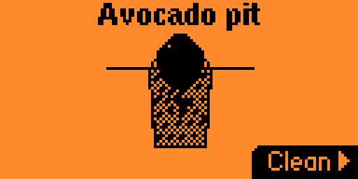
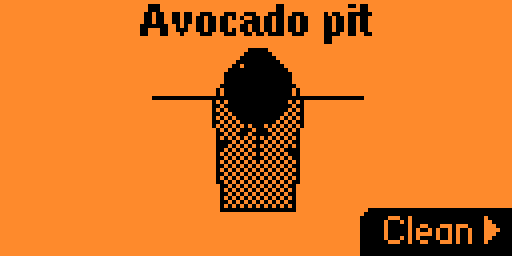

# Avocado Zero

A tiny **care sim** for Flipper Zero: you suspend an avocado pit over a glass of water (toothpicks and all) and try to keep it alive long enough to grow a full root system. Time passes, the water gets murky, and if you neglect it for too long—game over.

## How to play

- **Clean** the glass when the water is dirty so your pit stays healthy. Cleaning when it really needs it helps the roots grow.
- **Days** tick by in real time; dirt builds up if you stay away too long.
- **Win** when the roots reach their full length—then you can start a fresh pit and do it again.
- If the water gets **too dry or too filthy**, it is **game over**; hit **Start** to try again from the beginning.

## Screenshots

Your pit, the glass, and the sticks holding it on the rim—then **Clean** when things get gross.

Roots stretching down as you keep the water in good shape.

Pushed your luck too far? New run with **Start**.

## Requirements

- **On device:** build with [flipperzero-firmware](https://github.com/flipperdevices/flipperzero-firmware) (`./fbt`) or UFBT using this app’s sources.
- **Host only:** GCC and `make` for `make test` (no Flipper SDK).

## Build

| Target | Description |
|--------|-------------|
| `make test` | Domain logic unit tests on the host |
| `make prepare` | Symlink this repo into `applications_user/avocado_zero` next to your firmware tree |
| `make fap` | Clean firmware build output and compile the `.fap` (requires `FLIPPER_FIRMWARE_PATH`) |
| `make linter` | `cppcheck` on app sources |
| `make format` | `clang-format` tracked `.c` / `.h` |

Set `FLIPPER_FIRMWARE_PATH` if your firmware tree is not next to this repo.

## Save

Progress is stored on the SD card at `/ext/apps_data/avocado_zero/data.bin`.

## License

See `LICENSE`.
